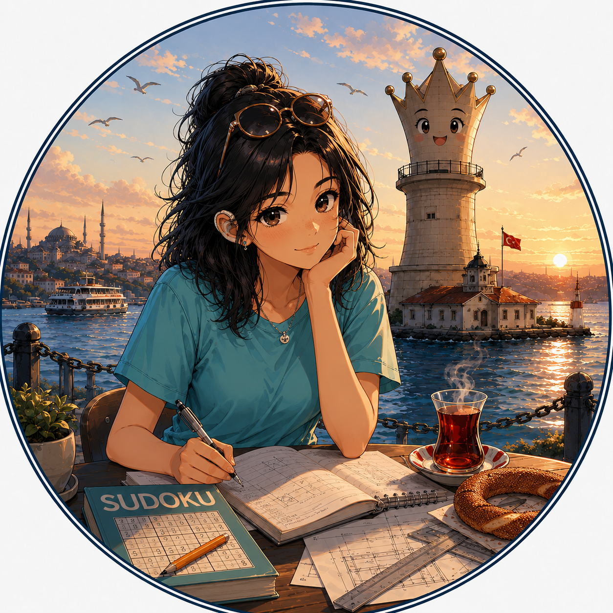

# MeriJane

> **A personality-driven Lichess BOT powered by Stockfish.**

Unlike traditional chess bots that always play the engine's top choice, MeriJane tries to choose moves that match her personality.

She has moods.

She sometimes overthinks.

She occasionally panics.

She loves the Italian Game.

She secretly believes Sudoku is better than chess.

And every now and then, she might quote Istanbul.

<p align="center">
  
</p>

--

## Features

- Official Lichess BOT
- Powered by Stockfish
- MultiPV candidate move selection
- Personality-driven move choice
- Dynamic mood engine
  - Anxiety
  - Confidence
  - Panic
- Adaptive thinking time
- Character-driven chat
- Hearing-aid jokes
- Istanbul-inspired messages
- Sudoku enthusiast
- Italian Game preference
- Arena benchmark mode
- Mood history graphs
- Chat logging
- Session game limits

---

## Meet MeriJane

> Hi! I'm MeriJane.
>
> I enjoy calm positions, the Italian Game, rainy days, Sudoku and Istanbul.
>
> I don't always play the strongest move. I try to play the one that feels right.
>
> I sometimes overthink but I never stop enjoying beautiful chess.
>
> I secretly believe Sudoku is better than chess... but please don't tell Stockfish.
>
> **Good luck and don't rush.** 🦻♟️

---

## Personality

Unlike most chess engines, MeriJane has an internal state.

Her decisions are influenced by:

- Confidence
- Anxiety
- Panic
- Opening preferences
- Randomness
- Position complexity

This does **not** make her stronger.

It makes her more human.

---

## Mood Engine

During every game MeriJane continuously updates:

- Confidence
- Anxiety
- Panic

These influence:

- Move selection
- Thinking time
- Chat behaviour

---

## Chat

MeriJane occasionally says things like:

> "I have fewer seconds than candidate moves."

> "Tea usually improves my evaluation."

> "I am listening to Istanbul with my eyes closed."

> "Sorry... my hearing aid battery just died. I can't hear your threats anymore."

> "Nah. Sudoku is better than chess anyway."

Messages are intentionally rare to avoid spam.

---

## Architecture

```text
Lichess
    │
    ▼
Bot
    │
    ▼
Stockfish (MultiPV)
    │
    ▼
Mood Engine
    │
    ▼
Move Selector
    │
    ▼
Chat Director
    │
    ▼
Logger
```

---

## Local Arena

Play MeriJane against herself:

```bash
python scripts/local_arena.py \
    --mode merijane-vs-merijane
```

Or against Stockfish:

```bash
python scripts/local_arena.py \
    --mode merijane-vs-stockfish
```

Arena exports:

- PGN
- CSV
- JSON
- Opening statistics
- Elo estimates
- Mood history
- Think-time graphs

---

## Roadmap

- [x] Mood engine
- [x] MultiPV move selection
- [x] Adaptive thinking time
- [x] Personality chat
- [x] Hearing-aid personality
- [x] Istanbul references
- [x] Sudoku personality
- [x] Official Lichess BOT
- [ ] Opening repertoire expansion
- [ ] Additional personality traits
- [ ] Online statistics dashboard

---

## License

Licensed under the **Apache License 2.0**.

This project uses **Stockfish**, which is distributed separately under the **GNU GPL v3**.